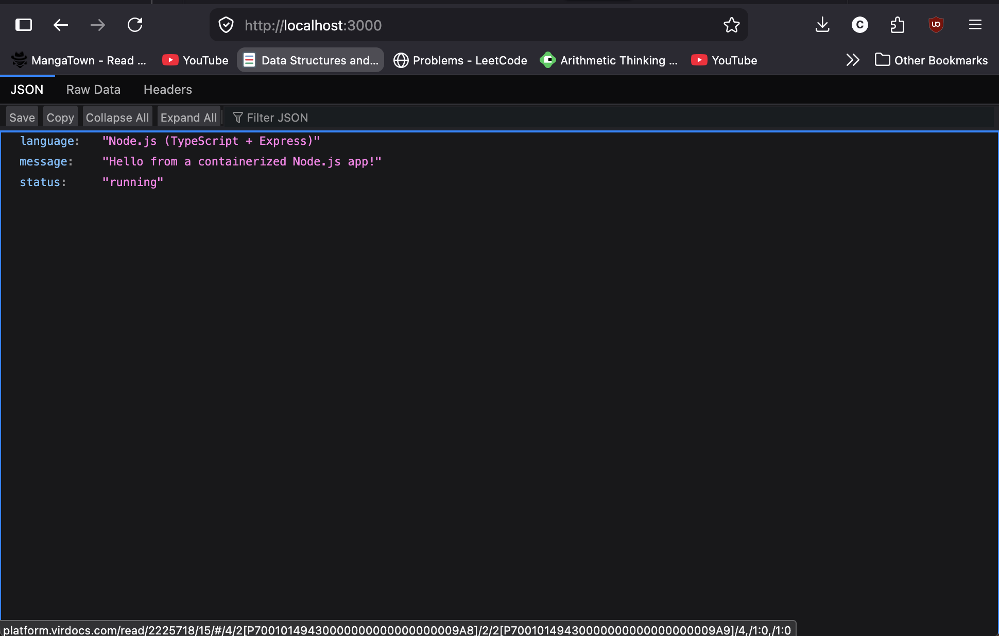
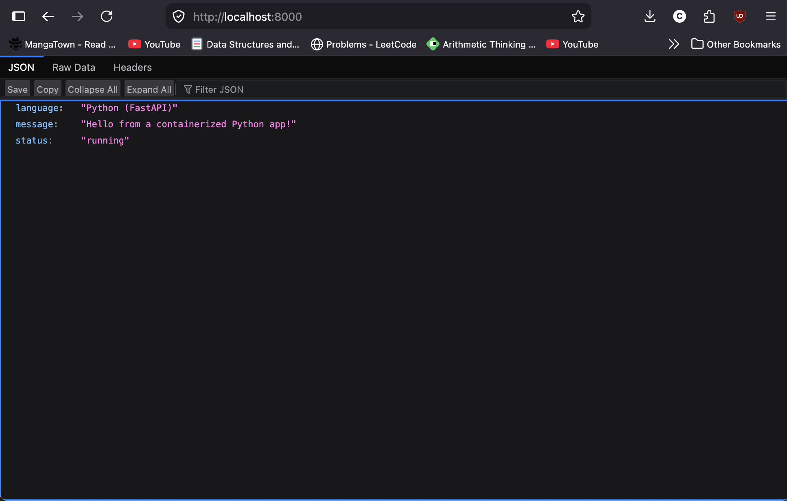
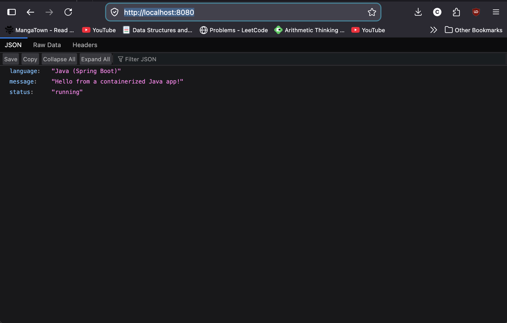
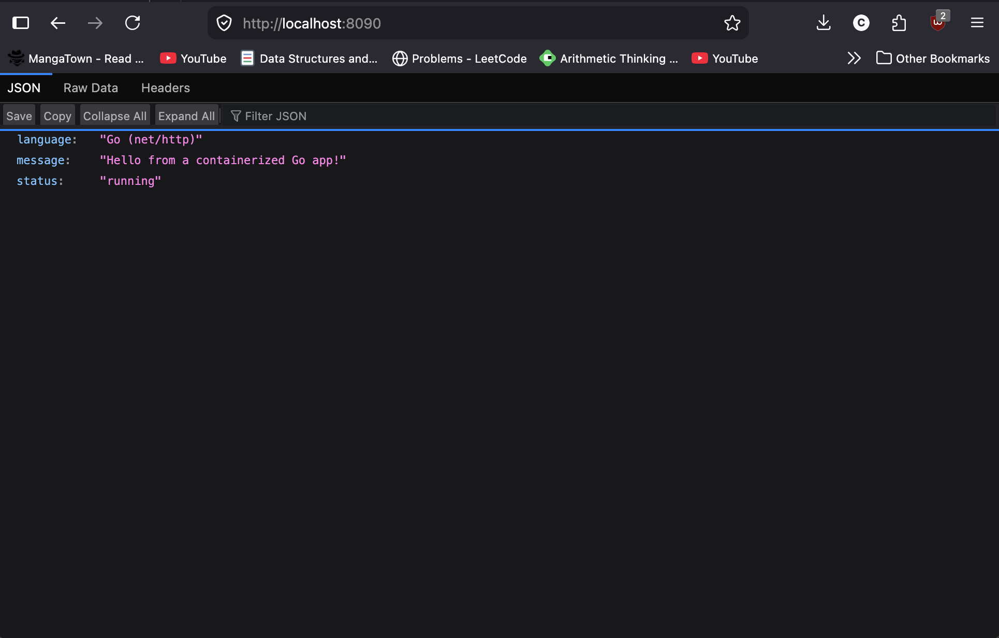

# Docker Language Guides – Part 8 & 9

Coursework for the cloud computing Docker module. This repo contains a containerized
sample application in each of the four languages from Docker's language-specific guides:
**Node.js, Python, Java, and Go**. Each app exposes a `/` route that returns JSON and a
`/health` route.

The image-building best practices from **Part 8** are applied throughout: multi-stage
builds (Node, Java, Go), pinned base images, `.dockerignore` files, and running as a
non-root user.

## Repository layout

```
.
├── node/      Node.js (TypeScript + Express)   -> port 3000
├── python/    Python (FastAPI)                 -> port 8000
├── java/      Java (Spring Boot + Maven)       -> port 8080
├── go/        Go (net/http)                    -> port 8090
└── screenshots/
```

Each folder has its own `Dockerfile`, `compose.yaml`, and `.dockerignore`.

## How to build and run each app

Run these from inside each language folder. Either the plain `docker` commands or the
`docker compose` one-liner works.

### Node.js (port 3000)
```bash
cd node
docker build -t node-docker .
docker run -p 3000:3000 node-docker
# then visit http://localhost:3000
```

### Python (port 8000)
```bash
cd python
docker build -t python-docker .
docker run -p 8000:8000 python-docker
# then visit http://localhost:8000
```

### Java (port 8080)
```bash
cd java
docker build -t java-docker .
docker run -p 8080:8080 java-docker
# then visit http://localhost:8080
```

### Go (port 8090)
```bash
cd go
docker build -t go-docker .
docker run -p 8090:8090 go-docker
# then visit http://localhost:8090
```

### Or with Compose (from any one folder)
```bash
docker compose up --build
```

Expected response at `/` (Node example):
```json
{"language":"Node.js (TypeScript + Express)","message":"Hello from a containerized Node.js app!","status":"running"}
```

## Screenshots

Replace each placeholder below with a screenshot of the app running. A good screenshot
shows the `docker run` terminal output **and** the browser at the URL (or a `curl`
response). Save images into the `screenshots/` folder using the names below.

### Node.js


### Python


### Java


### Go


## Notes

All four images use Docker best practices from Part 8: small/pinned base images,
multi-stage builds to keep final images lean, `.dockerignore` to shrink build context,
and a non-root runtime user.
